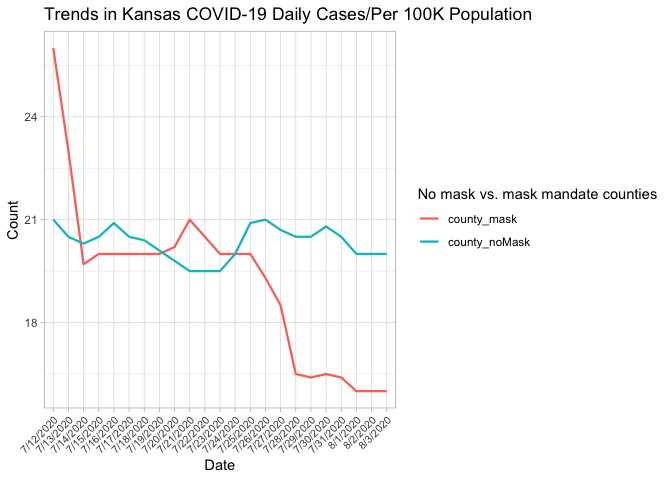
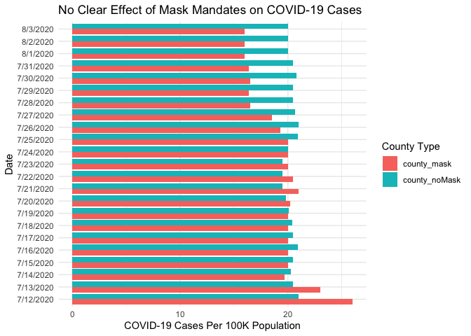

Lab 07 - Conveying the right message through visualisation
================
Cynthia Jiao
02/24/2025

### Load packages and data

``` r
library(tidyverse) 
library(ggplot2)
```

### Exercise 1

``` r
df <- tribble(
  ~date, ~county_mask, ~county_noMask,
  "7/12/2020", 26, 21,
  "7/13/2020", 23, 20.5,
  "7/14/2020", 19.7, 20.3, 
  "7/15/2020", 20, 20.5,
  "7/16/2020", 20, 20.9,
  "7/17/2020", 20, 20.5,
  "7/18/2020", 20, 20.4,
  "7/19/2020", 20, 20.1,
  "7/20/2020", 20.2, 19.8,
  "7/21/2020", 21, 19.5,
  "7/22/2020", 20.5, 19.5,
  "7/23/2020", 20, 19.5,
  "7/24/2020", 20, 20,
  "7/25/2020", 20, 20.9,
  "7/26/2020", 19.3, 21,
  "7/27/2020", 18.5, 20.7,
  "7/28/2020", 16.5, 20.5,
  "7/29/2020", 16.4, 20.5,
  "7/30/2020", 16.5, 20.8,
  "7/31/2020", 16.4, 20.5,
  "8/1/2020", 16, 20,
  "8/2/2020", 16, 20,
  "8/3/2020", 16, 20
)
```

### Exercise 2, 3, & 4

Compared to the original graph, the new graph is clearer in terms of 1).
the decline in daily cases for mask mandate counties. 2). the gap
between mask vs. no-mask counties over time. 3). the general trend
without distracted fluctuation between each day.

Based on this data and graph, mask mandate seems effective in reducing
the increasing COVID case. Despite some daily fluctuation, it is clear
that the blue line (representing county with no mask mandate) stays
within a consistent range of case number over time. But for the red line
(representing county with mask mandate), the case number overall
drastically dropped and seems to stay in a lower range than the blue
line over time.

``` r
df_long <- df%>%
  pivot_longer(cols = c(county_mask, county_noMask),
    names_to = "mask_type",
    values_to = "count"
  )


df_long %>%
  ggplot(aes(
    x = date,
    y = count,
    group = mask_type,
    color = mask_type
  )) +
  geom_line(size = 0.8) +
  ggtitle("Trends in Kansas COVID-19 Daily Cases/Per 100K Population") +
  labs(x = "Date", y = "Count", color = "No mask vs. mask mandate counties") +
  theme_light() +
  theme(axis.text.x = element_text(angle = 45, hjust = 1, size = 8)) 
```

    ## Warning: Using `size` aesthetic for lines was deprecated in ggplot2 3.4.0.
    ## ℹ Please use `linewidth` instead.
    ## This warning is displayed once every 8 hours.
    ## Call `lifecycle::last_lifecycle_warnings()` to see where this warning was
    ## generated.

<!-- --> \### Exercise 5,
6, & 7

In the graph above, the message that mask mandate helps reduce cases of
COVID 19 is clearly conveyed because the trend of county with mask
mandate vs. no mask mandate overtime is easy to read as lines. Another
way to visualize continuous data on is bar graph, but it is not the most
proper graph to use here as date (despite it is treated as categorical)
can be perceived continuous and thus better visualized as line, not
bars. Therefore, to create more misleading graph with the orginal
dataset, I used bar graph to represent the trend. I also flipped the x
and y axis so that it is harder to grasp the trend over time.

``` r
ggplot(df_long, aes(y = date, x = count, fill = mask_type)) +
  geom_bar(stat = "identity", position = "dodge") +
  labs(title = "No Clear Effect of Mask Mandates on COVID-19 Cases",
       x = "COVID-19 Cases Per 100K Population", 
       y = "Date",
       fill = "County Type") +
  theme_minimal()
```

<!-- -->
